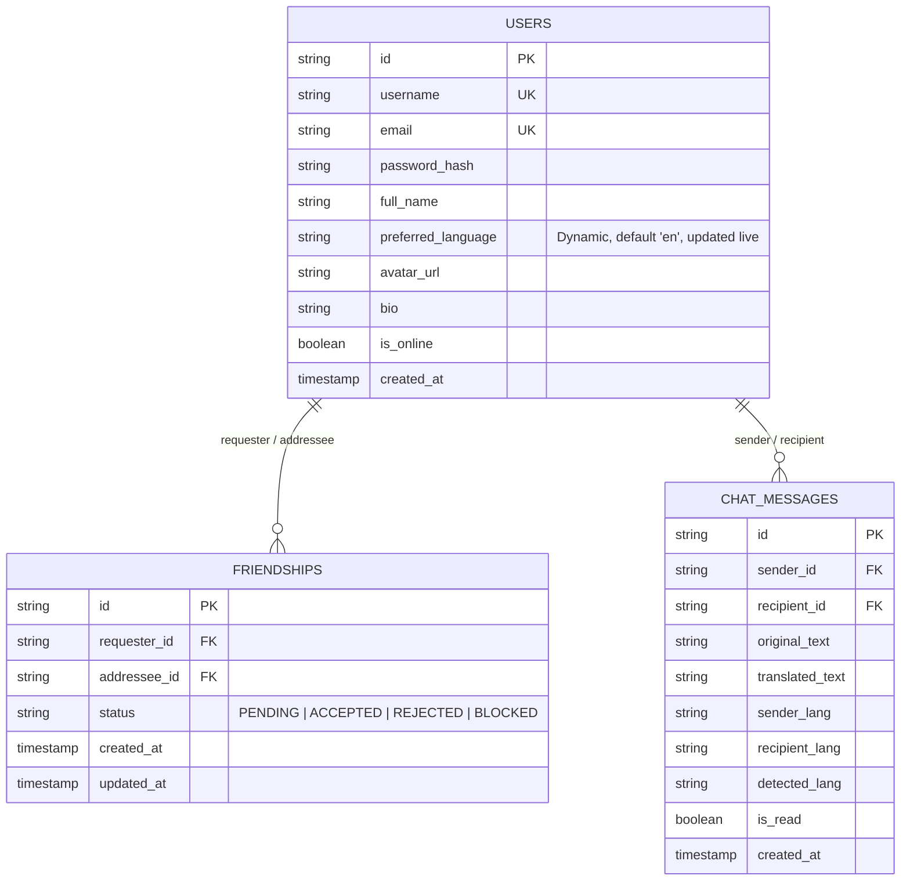

# TalkTranslate - Real-Time Multilingual Chat Backend (BE)
## Comprehensive Architecture & Implementation Blueprint (`PLAN.md`)

---

## 1. Project Overview & Updated Requirements

**TalkTranslate** is a backend service for a real-time multilingual social communication platform built with **Spring Boot 3** and **WebSockets (STOMP)**.

### 🌟 Core User Workflow
1. **Standard User Authentication (Sign Up & Login)**:
   - **Sign Up**: A new user creates an account by providing standard credentials: **Username, Email, Password, and Full Name** .
   - **Login**: Existing users authenticate with their **Username/Email and Password** and receive an authentication token / session.
2. **Social & Friend Connection (Instagram / Facebook Style)**:
   - The user browses **Suggested Users** (recommended active users).
   - The user sends a **Friend Request** to a suggested user (`PENDING` state).
   - The recipient views incoming requests and can **Accept** or **Reject** them.
   - Once accepted, a mutual friendship is established (`ACCEPTED` state).
3. **Friend-Authorized Real-Time Multilingual Chat**:
   - 1-on-1 direct chat is enabled between accepted friends.
   - **Recipient-Centric Automatic Translation**:
     - User A types in their native language (e.g., **Hindi**: *"नमस्ते, आप कैसे हैं?"*).
     - Backend verifies friendship, detects Hindi, retrieves Friend B's current active language (**English**), and translates the message into *"Hello, how are you?"*.
     - Friend B receives the translated English message in real-time over WebSockets (`/user/queue/messages`).
     - When Friend B replies in English (*"I am doing great!"*), User A receives the reply translated automatically into Hindi (*"मैं बहुत अच्छा कर रहा हूँ!"*).
4. **🔥 Dynamic Live Language Switching (In-Conversation Feature)**:
   - Users can **change/switch their preferred language live at any time** (before or during an ongoing conversation).
   - When User A switches their language from English to Spanish mid-chat:
     - The preference is updated instantly in the backend via REST (`PUT /api/users/language`) or WebSocket (`/app/chat.changeLang`).
     - All subsequent incoming messages from Friend B are immediately translated into **Spanish** in real-time.
   - Supports 20+ major world languages with live switching and message re-translation.

---

## 2. End-to-End User Journey Diagram

```mermaid
flowchart TD
    subgraph Step1 ["Step 1: Standard Authentication (No Language in Form)"]
        A[User Accesses App] --> B{Has Account?}
        B -->|No| C[Sign Up: Username, Email, Password, Full Name]
        B -->|Yes| D[Log In via /api/auth/login]
        C --> D
    end

    subgraph Step2 ["Step 2: Social & Friend System (Instagram/FB Style)"]
        D --> E[User Dashboard]
        E --> F[GET /api/users/suggested - View Suggested Users]
        F --> G[POST /api/friends/request/{id} - Send Friend Request]
        G --> H[Recipient Receives Request - Status: PENDING]
        H --> I{Recipient Action}
        I -->|Accept| J[POST /api/friends/accept/{id} - Status: ACCEPTED]
        I -->|Reject| K[POST /api/friends/reject/{id} - Status: REJECTED]
    end

    subgraph Step3 ["Step 3: Real-Time Chat with Live Language Switching"]
        J --> L[Friends Directory & Start 1-on-1 Chat]
        L --> M[User A sends in Hindi: 'नमस्ते, आप कैसे हैं?']
        M --> N[Spring Boot STOMP Broker & Translation Service]
        N --> O[Friend B receives in English: 'Hello, how are you?']
        
        O --> P[⚡ User B switches language live to Spanish mid-chat!]
        P --> Q[User A sends: 'क्या हम कल मिल सकते हैं?']
        Q --> R[Friend B now receives in Spanish: '¿Podemos encontrarnos mañana?']
    end
```

---

## 3. Backend File Structure

```
TalkTranslate/
├── pom.xml                                           # Maven build & Spring Boot 3 dependencies
├── PLAN.md                                           # Current architecture & requirements blueprint
├── README.md                                         # Backend setup & API guide
└── src/
    └── main/
        ├── java/com/talktranslate/
        │   ├── TalkTranslateApplication.java         # Spring Boot main entry point
        │   │
        │   ├── config/                               # Configuration layer
        │   │   ├── WebSocketConfig.java              # STOMP broker, SockJS endpoint (/ws), user queues
        │   │   └── SecurityConfig.java               # Password encoder (BCrypt) & CORS config
        │   │
        │   ├── controller/                           # REST & WebSocket Controller layer
        │   │   ├── AuthController.java               # POST /api/auth/signup, /api/auth/login, /api/auth/me
        │   │   ├── UserController.java               # GET /api/users/suggested, PUT /api/users/language (Live switch)
        │   │   ├── FriendshipController.java         # POST /api/friends/request, accept, reject; GET /api/friends
        │   │   ├── ChatController.java               # STOMP /app/chat.send, /app/chat.changeLang (Live WebSocket switch)
        │   │   ├── ChatHistoryController.java        # GET /api/chat/history/{friendId}
        │   │   └── ApiController.java                # GET /api/languages, POST /api/translate, GET /api/health
        │   │
        │   ├── model/                                # Domain Entities & Enums
        │   │   ├── User.java                         # User entity (username, email, password, active preferredLang)
        │   │   ├── Friendship.java                   # Friendship entity (requester, addressee, status)
        │   │   ├── FriendshipStatus.java             # PENDING, ACCEPTED, REJECTED, BLOCKED enum
        │   │   ├── ChatMessage.java                  # Chat message entity (originalText, translatedText, langs)
        │   │   ├── MessageType.java                  # CHAT, JOIN, LEAVE, TYPING, LANG_CHANGED enum
        │   │   ├── SupportedLanguage.java            # Supported language record (code, name, nativeName, flag)
        │   │   │
        │   │   └── dto/                              # Data Transfer Objects (DTOs)
        │   │       ├── SignUpRequest.java            # Registration payload (username, email, password, fullName)
        │   │       ├── LoginRequest.java             # Login payload (usernameOrEmail, password)
        │   │       ├── AuthResponse.java             # Auth success payload with user profile & token
        │   │       ├── UpdateLanguageRequest.java    # Live language switch payload (newLanguageCode)
        │   │       ├── FriendRequestDto.java         # Friend request creation DTO
        │   │       ├── FriendResponseDto.java        # Friend profile with online status & language
        │   │       ├── TranslationRequest.java       # Manual translation payload
        │   │       └── TranslationResponse.java      # Translation result payload
        │   │
        │   ├── repository/                           # Data Access Layer
        │   │   ├── UserRepository.java               # User queries (findByUsername, findByEmail, etc.)
        │   │   ├── FriendshipRepository.java         # Friendship queries (findFriends, findPendingRequests)
        │   │   └── ChatMessageRepository.java        # Message history queries
        │   │
        │   └── service/                              # Business Logic Layer
        │       ├── AuthService.java                  # User registration, login, password hashing
        │       ├── UserService.java                  # User search, suggested users, live language update
        │       ├── FriendshipService.java            # Send, accept, reject, list friends & requests
        │       ├── TranslationService.java           # Multi-tier translation (API + cache + offline fallback)
        │       └── ChatService.java                  # Friendship verification & recipient translation routing
        │
        └── resources/
            └── application.properties                # Port 8080 & application configuration
```

---

## 4. Database Entities & Schema Design



---

## 5. Detailed REST API Specifications

### 5.1. Authentication APIs (`/api/auth`)
| Method | Endpoint | Request Body | Response | Description |
|---|---|---|---|---|
| `POST` | `/api/auth/signup` | `{ "username", "email", "password", "fullName" }` | `AuthResponse` | Register a new user account (*No language required*) |
| `POST` | `/api/auth/login` | `{ "usernameOrEmail", "password" }` | `AuthResponse` | Authenticate user & return profile + token |
| `GET` | `/api/auth/me` | *Header: Authorization* | `User` | Get currently logged-in user profile |

### 5.2. Live Language Switching & User APIs (`/api/users`)
| Method | Endpoint | Request Body / Param | Description |
|---|---|---|---|
| `PUT` | `/api/users/language` | `{ "userId", "languageCode" }` | **Switch user's preferred language live** during chat |
| `GET` | `/api/users/suggested` | `?userId={id}` | Get suggested users to add as friends (Instagram/FB style) |
| `GET` | `/api/users/{userId}` | - | Get user profile details & current active language |

### 5.3. Friendship APIs (`/api/friends`)
| Method | Endpoint | Request Body / Param | Description |
|---|---|---|---|
| `POST` | `/api/friends/request/{targetUserId}` | `?userId={id}` | Send a friend request to a suggested user (`PENDING`) |
| `POST` | `/api/friends/accept/{requestId}` | `?userId={id}` | Accept a friend request (`ACCEPTED` - becomes mutual friends) |
| `POST` | `/api/friends/reject/{requestId}` | `?userId={id}` | Reject a friend request |
| `DELETE`| `/api/friends/cancel/{requestId}` | `?userId={id}` | Cancel an outgoing sent request |
| `GET` | `/api/friends/requests/incoming` | `?userId={id}` | List all pending incoming friend requests |
| `GET` | `/api/friends/requests/outgoing` | `?userId={id}` | List all pending outgoing friend requests |
| `GET` | `/api/friends` | `?userId={id}` | List all accepted friends (with online status & current language) |

### 5.4. Chat, History & Translation APIs (`/api/chat` & `/api/languages`)
| Method | Endpoint | Description |
|---|---|---|
| `GET` | `/api/chat/history/{friendId}` | Load chat history between two friends with translated text |
| `GET` | `/api/languages` | Get catalog of supported languages (Hindi, English, Spanish, Japanese, etc.) |
| `POST` | `/api/translate` | On-demand translation test endpoint |
| `GET` | `/api/health` | Health check and server status |

---

## 6. Real-Time WebSocket & STOMP Protocol

### 6.1. Connection Handshake
- **URL**: `ws://localhost:8080/ws` (with SockJS fallback `http://localhost:8080/ws`)

### 6.2. Destination Mappings
- **Client Sends Message**: `/app/chat.send`
  - Payload: `{ senderId, recipientId, originalText }`
  - **Server Action**:
    1. Validates mutual friendship status (`ACCEPTED`) between `senderId` and `recipientId`.
    2. Dynamically fetches recipient's **current active preferredLanguage** (e.g., if recipient switched live to Spanish, it translates to Spanish).
    3. Translates `originalText` into `translatedText`.
    4. Persists the message to `ChatMessageRepository`.
    5. Dispatches translated payload to `/user/{recipientId}/queue/messages` and echoes to sender.
- **Live Language Switch via WebSocket**: `/app/chat.changeLang`
  - Payload: `{ userId, newLanguage }`
  - Instantly updates recipient's translation target and notifies active chat sessions.
- **Typing Indicator**: `/app/chat.typing`
  - Payload: `{ senderId, recipientId, isTyping }`
  - Dispatches typing event to `/user/{recipientId}/queue/typing`.
- **Friend Request Notification**: `/user/{recipientId}/queue/notifications`
  - Real-time alert when a new friend request is received or accepted.
